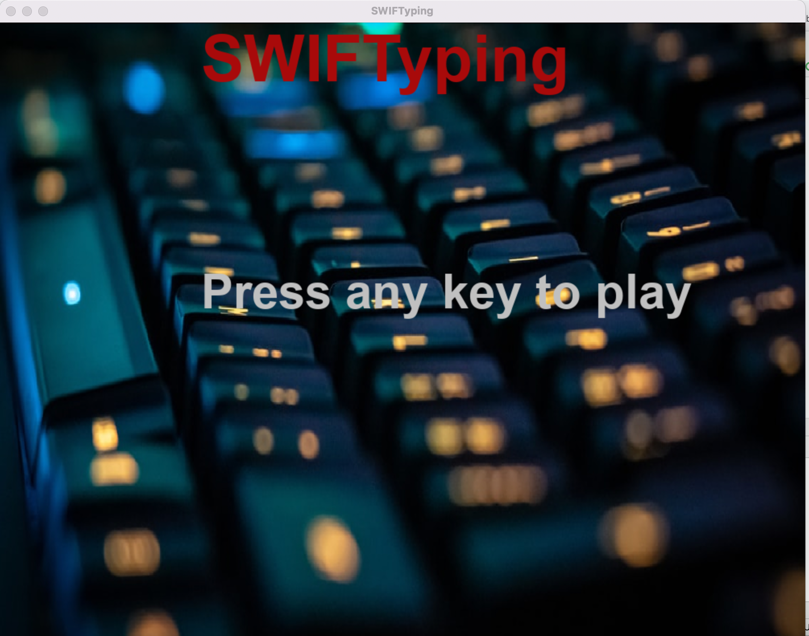
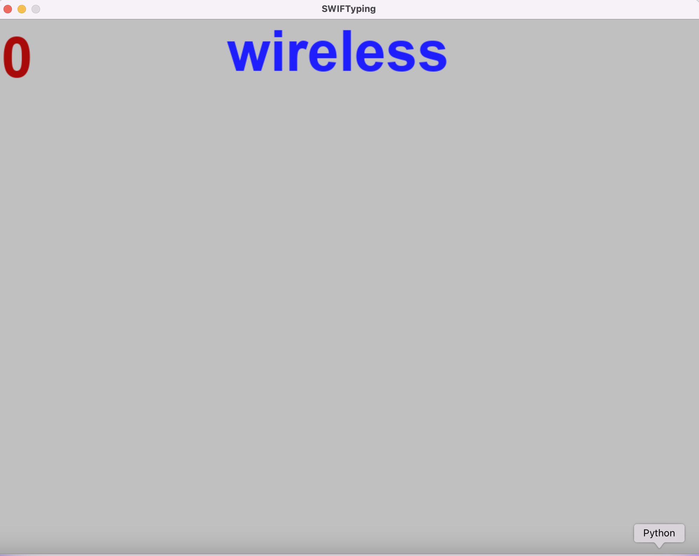
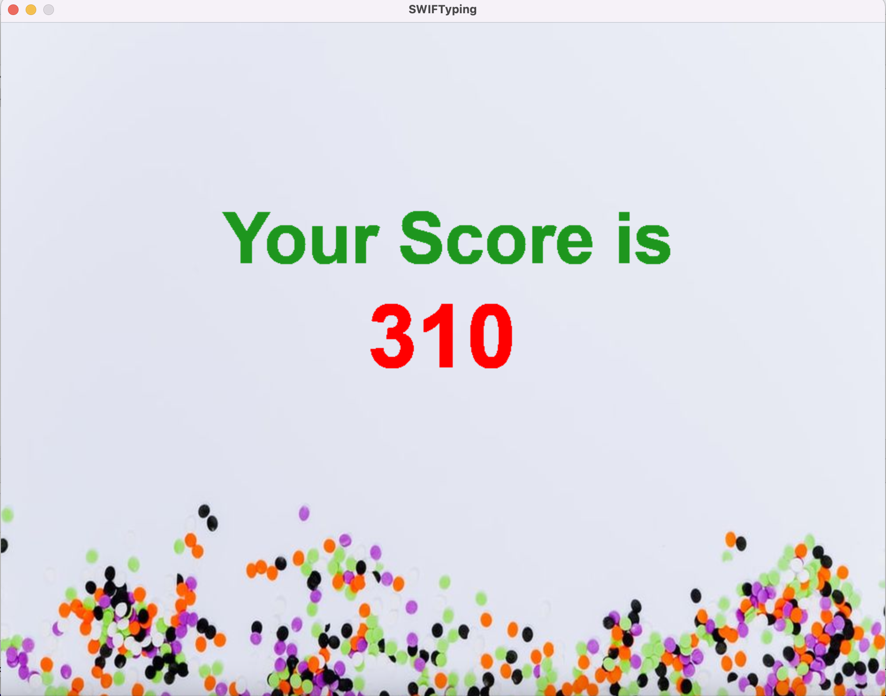

<h1>SWIFTyping </h1>
A word game that helps improve typing skills of the player. 
 
<b>Features of the game:</b>  
 
1) Words must be typed quickly before they pass the screen  
2) Speed of the words flowinhg increases as the player correctly types words 
3) Scoring is based on the length of words user was able to type 
4) once user fails to type in the word, game exits and scores are displayed. 
 
<b>Credits:</b> 
 
* Images are taken from unsplash 
* Music is from Youtube free audio library
 
 

<b>Menu Screen</b>

 
 
<b>Player screen </b>

 
 
<b>Final screen </b>

